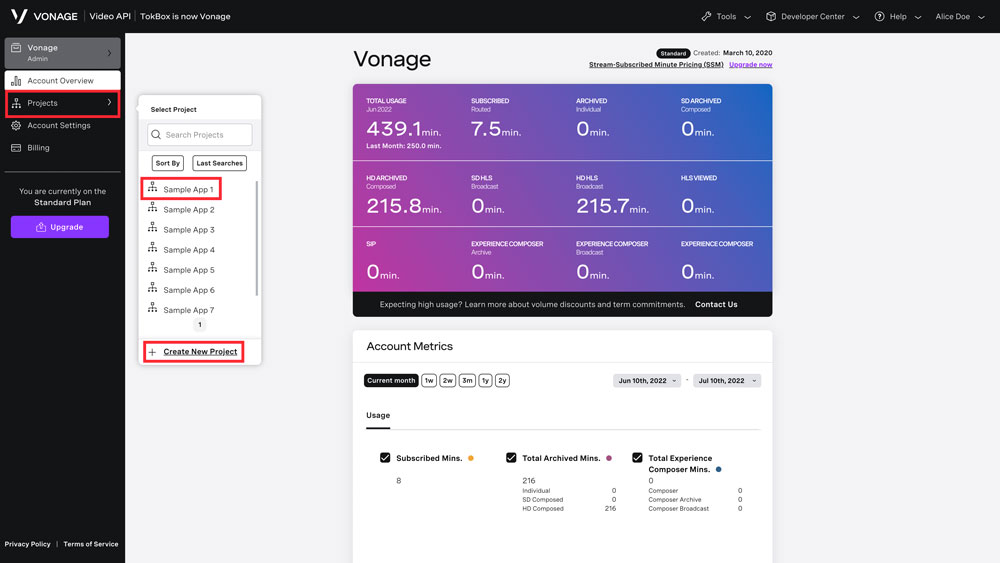
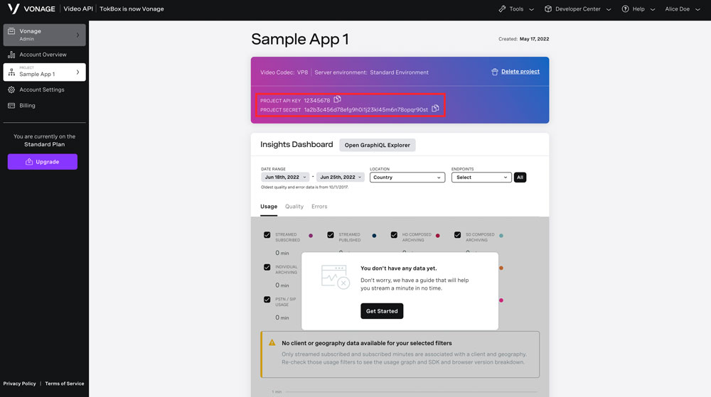
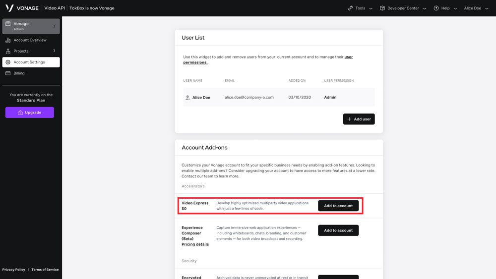

Use this extension to quickly add multiparty video chats to your application using the [Vonage Video Express](https://tokbox.com/developer/video-express/).

This extension will create rooms `/rooms/{roomId}` in Cloud Firestore and with Cloud Functions, generate credentials needed to participate in the video chats.

### Things you will need:

- Firebase [Cloud Functions](https://console.firebase.google.com/project/_/functions) and [Cloud Firestore](https://console.firebase.google.com/project/_/firestore) must be enabled in your project's console. The extension will need these to function properly.

- a Vonage Video Account. If you don't have one, you can sign up at the [Video API Dashboard](https://tokbox.com/account).

- Project API Key and Secret. In the left-side menu of the [dashboard](https://tokbox.com/account), click `Projects` and select a previous project or create a new one to view the API Key and Secret.

  
  

- Video Express add-on. Click Account Settings in the left-side menu. In the list of Account add-ons, find Video Express and click Add to account. Then follow the remaining instructions to enable the add-on.
  
  

### Billing:

To install an extension, your project must be on the [Blaze (pay as you go) plan](https://firebase.google.com/pricing)

- You will be charged a small amount (typically around $0.01/month) for the Firebase resources required by this extension (even if it is not used).
- This extension uses other Firebase, which have associated charges if you exceed the service’s no-cost tier:
  - Cloud Firestore
  - Cloud Functions (Node.js 10+ runtime. [See FAQs](https://firebase.google.com/support/faq#extensions-pricing))
- This extension also uses the Vonage Video API which has a monthly charge. [See Pricing](https://www.vonage.com/communications-apis/video/pricing/)