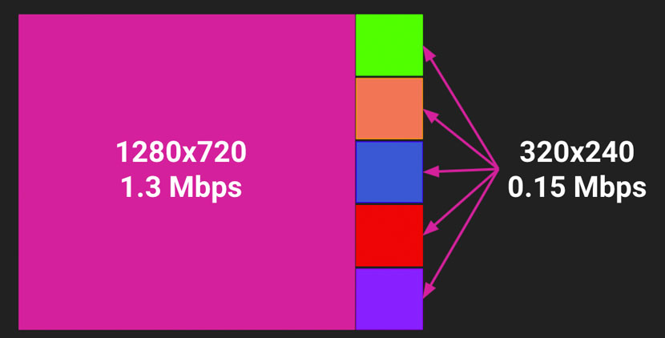
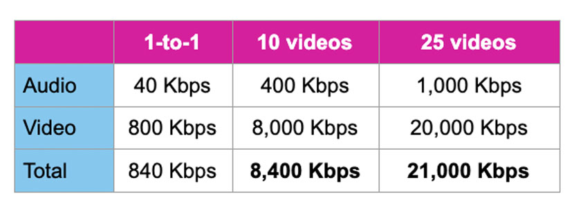
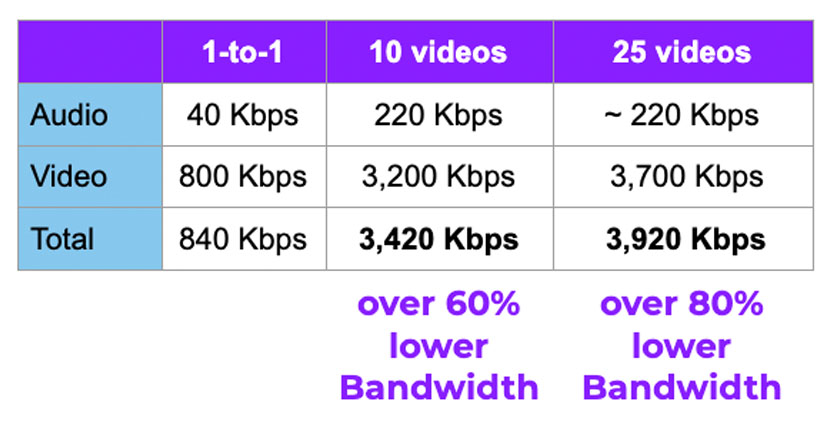

# Create Multiparty Video Calls with Vonage Video Express

## Summary

With this [Firebase Extension](https://firebase.google.com/docs/extensions), quickly build sophisticated live video apps with many participants using the [Vonage Video Express](https://tokbox.com/developer/video-express/).

## Installation

Via the Firebase console, visit this [link](https://console.firebase.google.com/project/_/extensions/install?ref=vonage%2Ffirestore-vonage-video-express)

Via the [Firebase CLI](https://firebase.google.com/docs/cli), run this command
```
firebase ext:install vonage/firestore-vonage-video-express --project=destination_project_id
```

The Firebase Extension comes packaged with a [demo](https://github.com/Vonage/vonage-firebase-extensions/tree/main/demos/video-express/public) to show the Vonage Video Express in action.

## About Vonage Video Express

Not only does the Vonage Video Express helps remove the complexity of building an application with multiparty video and screenshare, it brings other optimizations.

### Quality Manager

To help create the best quality video call, various methods will be automatically applied like maximizing tile sizes for visible video streams and pausing ones not seen, adjusting resolutions and frame rates depending on network conditions and CPU, and setting higher priorities on speakers and screen shares.



### Experience Manager

Optimizations done on the client-side like muting participants past 10 and reducing bandwidth by requesting smaller streams for smaller sized videos to help increase user experience.

(Unoptimized Video Session)


(Optimized Video Session)


### Layout Manager

Automatically adjust the layout of the streams based on screen size and the number of participants.


